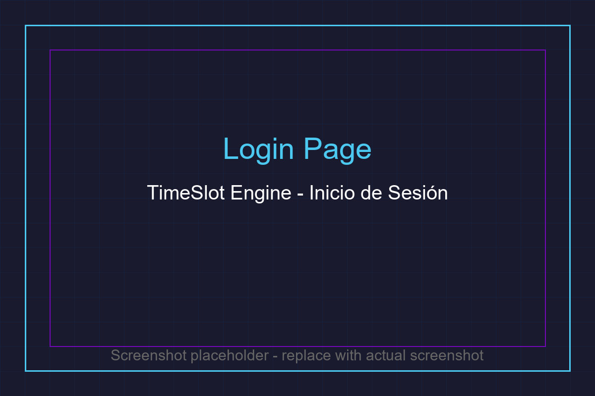
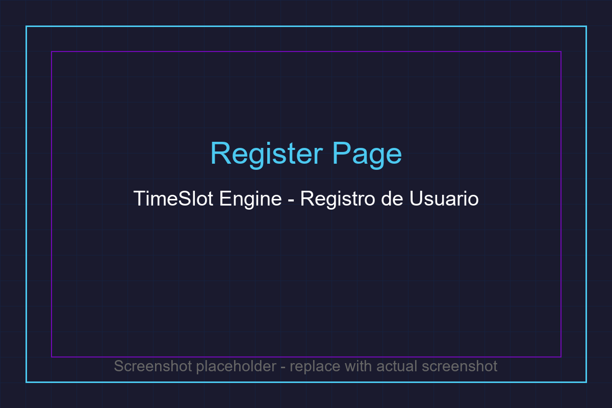
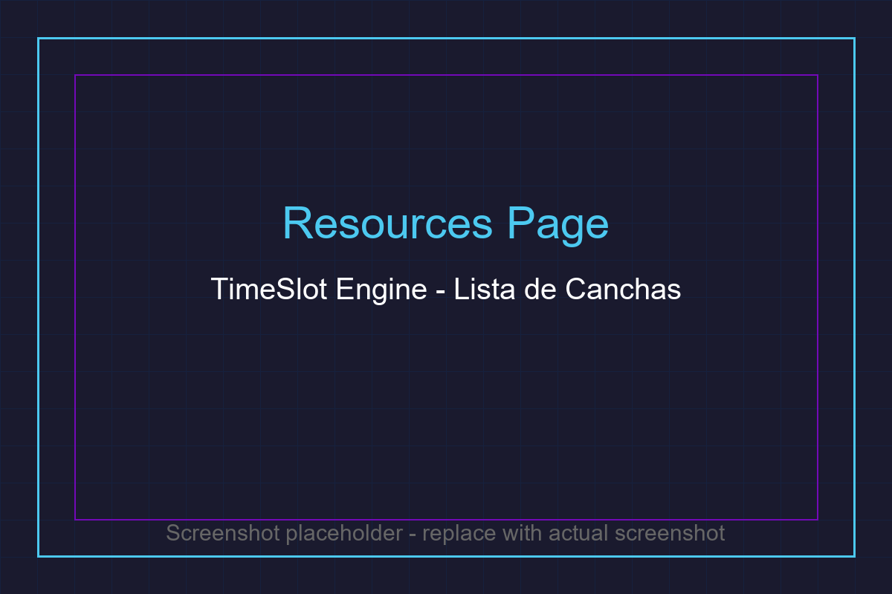
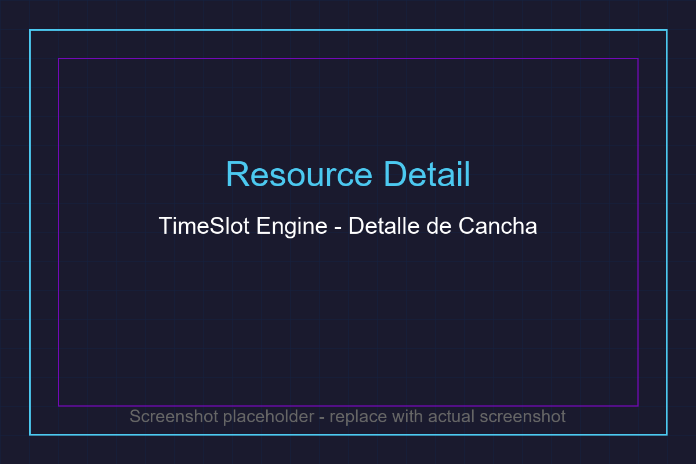
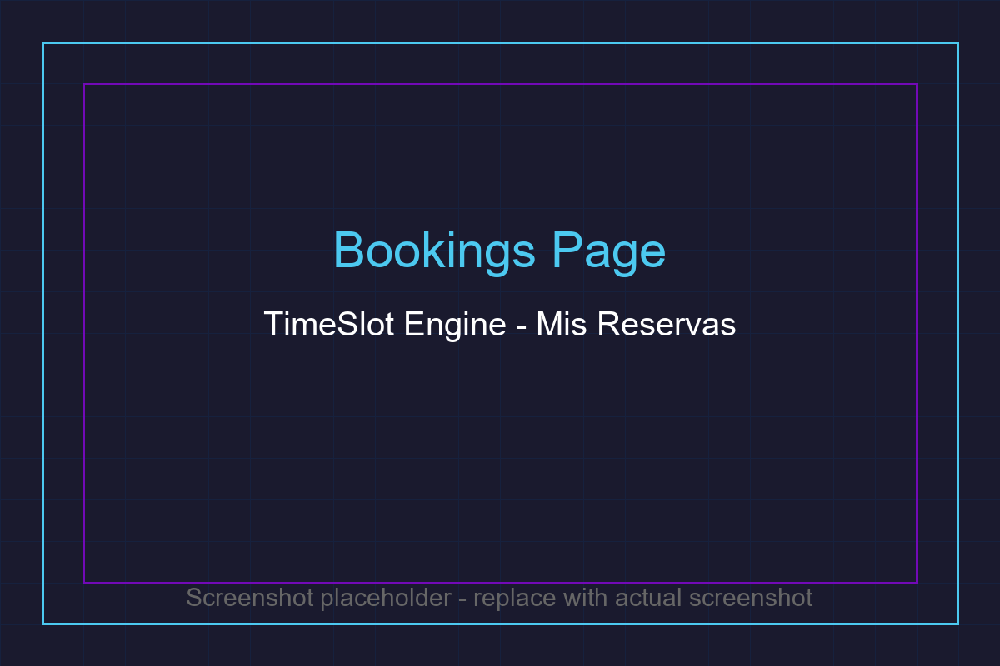
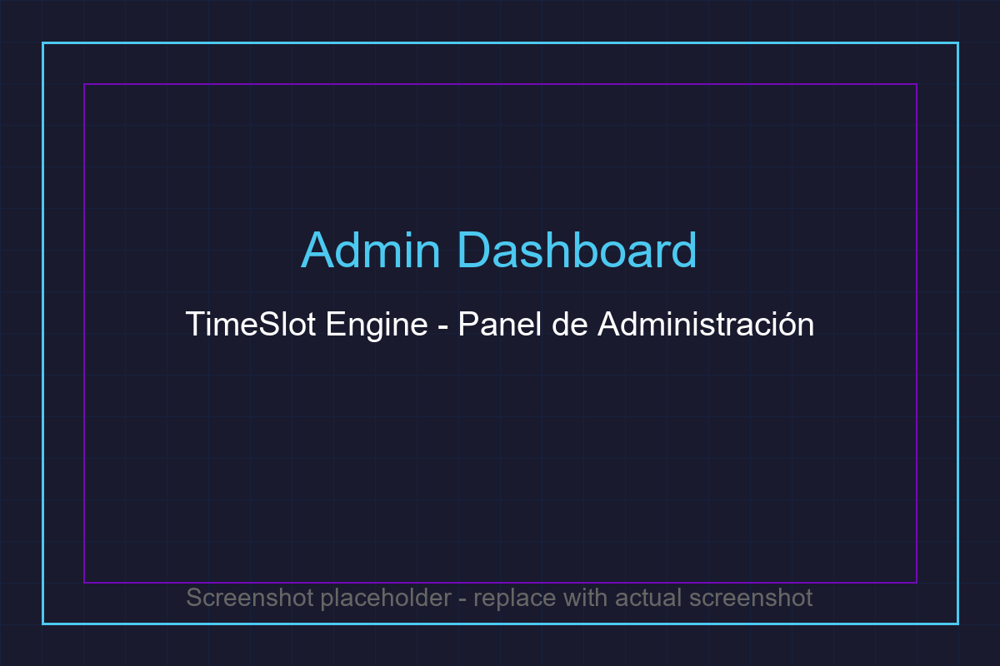
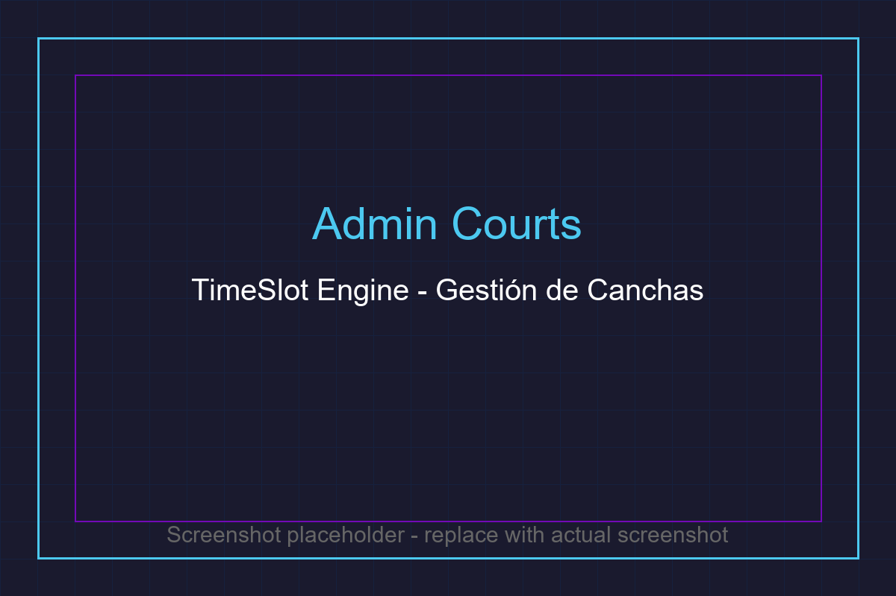
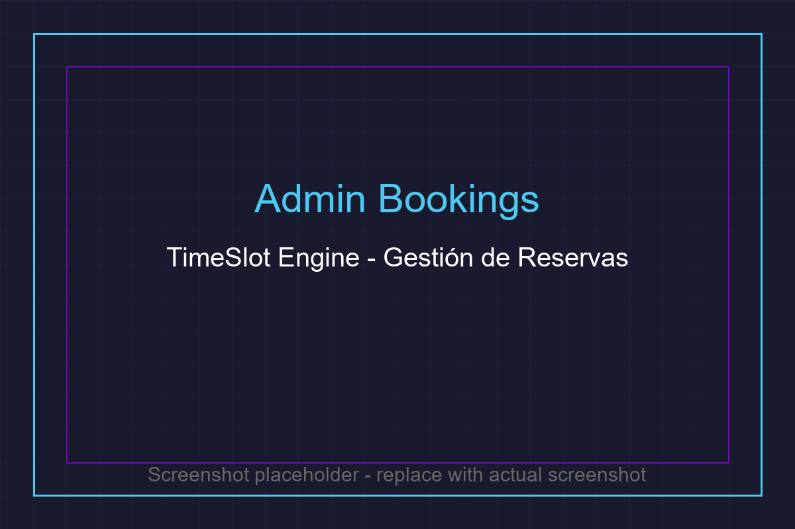

<div align="center">

⭐ **If you like this project, please star the repository!** ⭐

---

# 🏟️ TimeSlot Engine

**Sistema de gestión de reservas de canchas de pádel, tenis y fútbol 5**


</div>

---

## 💡 Overview

**TimeSlot Engine** es un sistema completo de gestión de reservas para canchas deportivas (pádel, tenis, fútbol 5). Permite a los usuarios registrarse, explorar canchas disponibles, reservar horarios y gestionar sus reservas en tiempo real. Los administradores pueden gestionar canchas, reservas, políticas de cancelación y usuarios desde un panel dedicado.

### Características principales:

- **Autenticación JWT** con tokens de acceso y refresco
- **Motor de disponibilidad** con soporte de zonas horarias
- **Prevención de solapamientos** mediante restricciones EXCLUDE en PostgreSQL
- **Políticas de cancelación** configurables (globales o por cancha)
- **Notificaciones en tiempo real** via WebSocket
- **Interfaz responsive** para dispositivos móviles y escritorio

---

## ✨ Features

- **🔐 Autenticación segura:** Registro, login y gestión de sesiones con JWT y Argon2.
- **🏟️ Gestión de canchas:** CRUD completo con fotos, horarios y precios configurables.
- **📅 Motor de disponibilidad:** Generación de slots en tiempo real con soporte de zonas horarias.
- **🎯 Reservas inteligentes:** Prevención de solapamientos a nivel de base de datos.
- **📋 Políticas de cancelación:** Sistema de reglas por niveles (global, por cancha o por defecto).
- **🔔 Notificaciones WebSocket:** Eventos en tiempo real para reservas creadas, confirmadas o canceladas.
- **👥 Roles de usuario:** Administradores y clientes con permisos diferenciados.
- **📱 Diseño responsive:** Interfaz adaptable a cualquier dispositivo.
- **📊 Panel de administración:** Gestión completa de canchas, reservas y usuarios.
- **📸 Subida de imágenes:** Soporte para fotos de canchas con drag-and-drop.

---

## 👩‍💻 Tech Stack

### Backend
- **NestJS** - Framework Node.js modular y escalable
- **Prisma** - ORM moderno para PostgreSQL
- **PostgreSQL** - Base de datos relacional con restricciones EXCLUDE
- **Passport.js** - Autenticación JWT
- **Argon2** - Hashing seguro de contraseñas
- **Socket.IO** - Comunicación WebSocket en tiempo real
- **Zod** - Validación de variables de entorno
- **Luxon** - Manejo de fechas y zonas horarias
- **Swagger + Scalar** - Documentación de API interactiva

### Frontend
- **React 19** - Biblioteca de interfaz de usuario
- **Vite** - Herramienta de construcción rápida
- **React Router** - Enrutamiento del lado del cliente
- **TanStack Query** - Gestión de estado del servidor
- **Axios** - Cliente HTTP con interceptor de tokens
- **Socket.IO Client** - Cliente WebSocket
- **Vitest** - Framework de testing

### Herramientas
- **pnpm** - Gestor de paquetes
- **TypeScript** - Tipado estático
- **ESLint + Prettier** - Calidad de código
- **Oxlint** - Linter rápido para frontend

---

## 📸 Screenshots

### Login Page


### Register Page


### Resources Page (Court Listing)


### Resource Detail (Booking)


### User Bookings


### Admin Dashboard


### Admin Courts Management


### Admin Bookings Management


---

## 📦 Getting Started

### 🚀 Prerequisites

- **Node.js** (v18.x o superior)
- **pnpm** (v8.x o superior)
- **PostgreSQL** (v14.x o superior)
- **Docker** (opcional, para base de datos)

### 🛠️ Installation

1. **Clone the repository:**

   ```bash
   git clone https://github.com/your-username/timeslot-engine.git
   cd timeslot-engine
   ```

2. **Setup Database (using Docker):**

   ```bash
   docker run -d \
     --name timeslot-db \
     -e POSTGRES_USER=timeslot \
     -e POSTGRES_PASSWORD=timeslot123 \
     -e POSTGRES_DB=timeslot_engine \
     -p 5432:5432 \
     postgres:16-alpine
   ```

3. **Setup Backend:**

   ```bash
   cd backend
   pnpm install
   cp .env.example .env
   # Edit .env with your database URL and JWT secrets
   pnpm run prisma:generate
   pnpm run prisma:migrate
   pnpm run seed
   pnpm run dev
   ```

4. **Setup Frontend (in a new terminal):**

   ```bash
   cd frontend
   pnpm install
   pnpm run dev
   ```

5. **Access the application:**
   - Frontend: http://localhost:5173
   - Backend API: http://localhost:3000/api
   - API Documentation: http://localhost:3000/docs
   - Scalar Reference: http://localhost:3000/reference

### 🎮 Demo Accounts

After running the seed command, you can use these accounts:

| Role | Email | Password |
|------|-------|----------|
| Admin | admin@timeslot.dev | Admin#2026 |
| Client | juan@timeslot.dev | Client#2026 |
| Client | ana@timeslot.dev | Client#2026 |
| Client | luis@timeslot.dev | Client#2026 |

---

## 📖 Usage

### Running the Application

**Development mode:**
```bash
# Backend
cd backend && pnpm run dev

# Frontend
cd frontend && pnpm run dev
```

**Production mode:**
```bash
# Backend
cd backend && pnpm run build && pnpm run start:prod

# Frontend
cd frontend && pnpm run build && pnpm run preview
```

### 📃 API Documentation

The API documentation is available at:
- **Swagger UI:** http://localhost:3000/docs
- **Scalar Reference:** http://localhost:3000/reference

### Key API Endpoints

| Method | Endpoint | Description |
|--------|----------|-------------|
| POST | `/api/auth/register` | Register new user |
| POST | `/api/auth/login` | Login (returns JWT pair) |
| GET | `/api/resources` | List all courts |
| GET | `/api/availability?resourceId=X&date=Y` | Get available slots |
| POST | `/api/bookings` | Create a booking |
| GET | `/api/bookings` | List user bookings |
| PATCH | `/api/bookings/:id/cancel` | Cancel a booking |

---

## 🏗️ Architecture

### Database Schema

The application uses 7 main models:

- **User** - Users with roles (ADMIN/CLIENT)
- **Resource** - Courts/canchas with schedules and photos
- **Booking** - Reservations with status tracking
- **ResourceSchedule** - Weekly operating hours
- **ResourcePhoto** - Court images
- **CancellationPolicy** - Tiered cancellation rules
- **RefreshToken** - JWT refresh token management

### Key Technical Decisions

1. **Overlap Prevention:** PostgreSQL EXCLUDE constraint with GiST index prevents race conditions
2. **Timezone Handling:** Luxon converts between resource-local time and UTC
3. **Cancellation Policies:** Strategy pattern with three implementations (Tiered, NoRefund, FreeUntilStart)
4. **Real-time Events:** Socket.IO with room-based targeting (per-user and admin rooms)
5. **Token Rotation:** Old refresh tokens are revoked on each refresh

---

## 🤝 Contributing

We welcome contributions to this project. Please follow these steps:

1. **Fork the repository.**
2. **Create a new branch** (`git checkout -b feature/your-feature-name`).
3. **Make your changes** and commit them (`git commit -m 'Add some feature'`).
4. **Push to the branch** (`git push origin feature/your-feature-name`).
5. **Open a pull request.**

Please make sure to update tests as appropriate.

### Development Guidelines

- Follow existing code style and conventions
- Write tests for new features
- Update documentation as needed
- Use conventional commit messages

---

## 🐛 Issues

If you encounter any issues, please check the [Issues](https://github.com/your-username/timeslot-engine/issues) section. When reporting an issue, please include:

- A clear and descriptive title
- Steps to reproduce the issue
- Expected vs actual behavior
- Environment details (OS, browser, Node.js version)
- Screenshots if applicable

---

## 📜 License

Distributed under the MIT License. See [LICENSE](./LICENSE) for more information.

---

## 🙏 Acknowledgements

- [NestJS](https://nestjs.com/) for the amazing backend framework
- [Prisma](https://www.prisma.io/) for the modern ORM
- [React](https://react.dev/) for the UI library
- [Vite](https://vitejs.dev/) for the fast build tool
- [Socket.IO](https://socket.io/) for real-time communication
